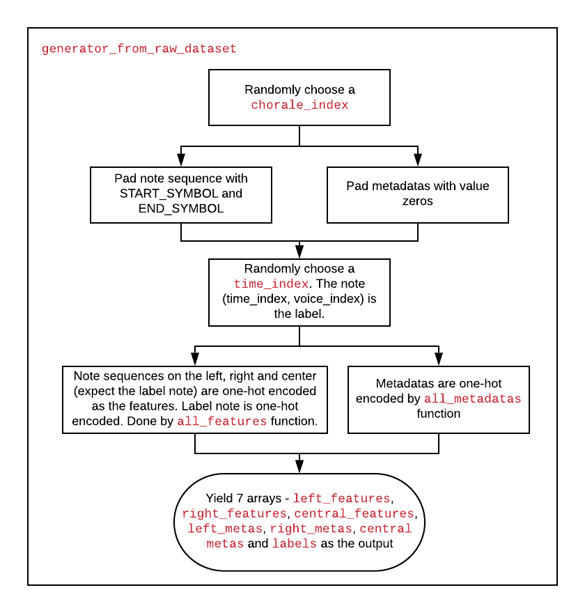

# deepBach Keras code explain

An explanation of deepBach Keras implementation

Original deepBach code: https://github.com/Ghadjeres/DeepBach/tree/original_keras

deepBach paper: https://arxiv.org/abs/1612.01010

## Overall
DeepBach is my second study case of music generation using deep learning. It is a nice example of using neighbor context information and metadata to predict the current note. The input representation is special - notes are discretized into a minimum time unit (subdivision of a 16th note) and using '_' for hold symbol, which are quite different from the pianoroll. The author claimed this representation is a benefit for the sampling since symbols are less correlated along the time.

The architecture is illustrated in Figure 4 in the original paper. They train 4 different models for each voice. The sampling (inference) is called Pseudo-Gibbs method by the author, where the notes of each voice are initialized randomly, then are predicted by the models.

The attention of this article will be drawn on the code of constructing training dataset and preparation generator for model training.

## Constructing training dataset

The dataset generation is started by `initialization` function in `deepBach.py`. It extracts Bach's chorales using the `getBachChorales` function of `music21` package (this function has been removed from the newest version of `music21`, check https://github.com/Ghadjeres/DeepBach/issues/38 for a solution). Some chorales with more than 4 voices are removed from the training data. 

Then here comes the main part of dataset preparation - `make_dataset` function. First, mappings between note names (e.g. A5, C4) appeared in the chorales and numbers are stored in `index2notes` and `note2indexes` variables. 4 mappings are stored differently for each voice. Second, the min and max vocal range of each voice is estimated, and each chorale is transposed within this range. The transposition is done by `music21`. Third, the `chorale` music21 object including notes and metadatas is converted to a 2D numpy array by `chorale_to_input` function, where the 1st dim is timestamp, 2nd dim is voice number, and metadatas including Tick (subdivision beat number), Fermata and Key are also evaluated. Lastly, all information including note sequences (in index number), metadatas, voice Ids, `index2notes` and `note2indexes` are stored in a pickle file, which is then loaded several times during the model training and sampling.

## Generator

When it comes to sending data into models for training, the original Keras implementation uses `generator_from_raw_dataset`. Each time it is called, it does the following things. First, a `chorale_index` is randomly choosed so that we can sample from a certain chorale. Second, the note sequence of this chorale is padded with an array of START_SYMBOL and another array of END_SYMBOL. Both array have a dimension of (timesteps=16, voice number=4). Padding allows us to choose the leftmost and rightmost note sequences as the training samples. Third, metadata sequences are padded accordingly with values zero. Fourth, a `time_index` is randomly choosed from the unpadded note sequence range, and a `voice_index` is given as the voice to be predicted. Thus, the note sequences (timesteps=16 to both left and right sides) surround the note (time_index, voice_index) are used as training features. Fifth, the note sequences on the left side, on the right side, and centered on the `time_index` are one-hot encoded, and 4 voices one-hot vectors in each timestep are concatenated into a many-one-hot vector. The label is one hot encoded as well. Metadatas are one-hot encoded and concatenated in the feature dimension. Finally, 7 arrays - `left_features`, `right_features`, `central_features`, `left_metas`, `right_metas`, `central_metas` and `labels` are yielded as the generator output.

So that's it. Personally, these two parts are the most difficult parts in understanding deepBach code. Enjoy your journey of exploring such a nice model!